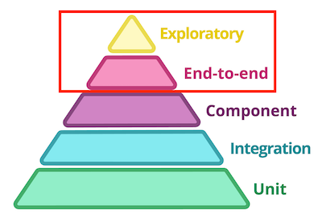

Touchstone
======
**Touchstone** is a testing framework that focuses on [end-to-end](https://www.martinfowler.com/bliki/BroadStackTest.html) and [exploratory](https://martinfowler.com/bliki/ExploratoryTesting.html) testing for your services.

**Touchstone is currently in ALPHA and APIs may change without warning**

## Introduction

Credit: [https://martinfowler.com/articles/microservice-testing/#conclusion-test-pyramid](https://martinfowler.com/articles/microservice-testing/#conclusion-test-pyramid)

Touchstone aims to simplify these two pieces of the testing pyramid by providing real implementations of common service dependencies and exposing them via an easy to use testing framework. Whether your app is written in Java, Python, Go, PHP, Ruby, C, [Fortran](https://www.fortran.io/), or any other language, Touchstone can handle its dependencies while you focus on development. Not a single line of end-to-end testing code changes should you decide to re-write your service.

## Supported Dependencies
 * HTTP
 * Mongo DB
 * My SQL
 * Rabbit MQ
 
Don't see a dependency you want to include in your testing? [Add one!]()
