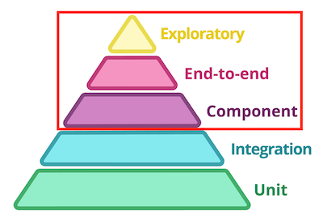

Touchstone
======


Touchstone is a testing framework for your services that focuses on [component](https://martinfowler.com/articles/microservice-testing/#testing-component-out-of-process-diagram), [end-to-end](https://martinfowler.com/articles/microservice-testing/#testing-end-to-end-introduction), and [exploratory](https://martinfowler.com/bliki/ExploratoryTesting.html) testing.  


## Introduction
  
[Image Credit](https://martinfowler.com/articles/microservice-testing/#conclusion-test-pyramid)

Touchstone aims to simplify the top three pieces of the testing pyramid by providing real implementations of common service dependencies and exposing them via an easy to use testing framework. Whether your app is written in Java, Python, Go, C#, [Fortran](https://www.fortran.io/), or any other language, Touchstone handles its dependencies while you focus on writing tests. Not a single line of component or end-to-end testing code needs to change should you decide to refactor or rewrite your service.


## Use Case
Let's say we are building a microservice that is responsible for managing users. The service exposes a REST API and the requirements for each endpoint are as follows:
 * `GET /user/{id}` - A user is retrieved from a relational database and returned.
 * `POST /user` - A new user is submitted with a first name and last name. An HTTP call is made to an _Email Service_ where an email is returned for that user. The new user is then saved in a relational database and returned.
 * `PUT /user` - A user's id, first name, last name, and email are submitted and then updated in a relational database.
 * `DELETE /user/{id}` - A user is deleted from a relational database. A message is also published to a broker on the exchange: 'user.exchange' with a routing key of: 'user-deleted' and a payload containing the user's id.
 * The service is also listening for messages published to the exchange: 'order-placed.exchange'. When a message is received, the order payload is saved to a NoSQL database.

With Touchstone, it is possible to write component and end-to-end tests for all of the above requirements independent of the language/framework used. For example, we can write a component test for the `DELETE /user/{id}` endpoint that will ensure the user record is removed from the database and a message is published to the correct exchange with the correct payload. When ran, Touchstone will monitor real instances of the service's dependencies to ensure the requirements are met. Touchstone also makes it easy to perform exploratory testing locally during development by starting dependencies and populating them with data in a single command.

An example of the above requirements is implemented in a Java/Spring service in this repo. Touchstone tests have been written to test the [user endpoint requirements](./examples/java-spring/touchstone/tests/test_user.py) and [order messaging requirements](./examples/java-spring/touchstone/tests/test_order.py).


## Installation
`pip install touchstone-testing`

Requirements:
 * Python 3.6+
 * Docker


## Usage
After installation, Touchstone will be available via `touchstone` in your terminal.  
Touchstone has three basic commands:
 * `touchstone init` - Initialize Touchstone in the current directory. Used for new projects.
 * `touchstone run` - Run all Touchstone tests and exit. This is typically how you would run your Touchstone tests on a build server. Ports will be auto-discovered in this mode to avoid collisions in case multiple runs occur on the same host. See [dependency docs](#dependencies) for more information on how to hook into auto-discovered ports.
 * `touchstone develop` - Start a development session of Touchstone. You would typically use this to develop/debug a service locally. This will keep service dependencies running while you make changes to your Touchstone tests or the services themselves. This will also provide a web interface to each dependency for additional debugging. Dependencies can be altered or reset on the fly to make exploratory testing easier.
 
Touchstone has the following options:
 * `--log={LEVEL}` - Sets Touchstone's log level.
 * `--log-services` - Captures service logs and stores them in 'touchstone/logs'.
 
After running `touchstone init`, a new directory will be created with the following contents:

### `/touchstone.yml`
[Example](./examples/java-spring/touchstone/touchstone.yml)  
Your services and their monitored dependencies are defined here. Default values should be enough in most cases.
 * `services:` - Each service included in your Touchstone tests is defined here.
   * `name:` - Default: unnamed-service. The name of the service.
   * `type:` - Default: networked. The type of service under test. Allowed values: networked, executable
   * `tests:` - Default: ./tests. The path to Touchstone tests for this service. Use `null` if this is a "supporting" service skipping tests.
   * `port:` - Default: 8080. The port used for this service.
   * `dockerfile:` - Default: N/A. Used to containerize the service during `touchstone run`. If you are only running Touchstone locally, this can be omitted.
   * `docker_image` - Default: N/A. An alternative to `dockerfile`. A Docker image used to containerize the service during `touchstone run`.
   * `docker_options` - Default: N/A. Additional [Docker options](https://docs.docker.com/engine/reference/commandline/run/#options) to apply to your container.
   * `availability_endpoint:` - Default: N/A. By default, Touchstone runs a Docker health check to determine the services' health. Supply this value to use URL based health checking. A HTTP status `2xx` must be returned from the endpoint to be considered healthy.
   * `num_retries:` - Default: 20. The number of times Touchstone will try to successfully call the `availability_endpoint`.
   * `seconds_between_retries:` - Default: 5. The number of seconds between each retry.
 * `dependencies:` - Each dependency your service(s) are being tested against.
   * This is how Touchstone determines which dependencies should be started.
   * View each [dependency's docs](#dependencies) for values and additional configuration.

### `/defaults`
[Example](./examples/java-spring/touchstone/defaults/mysql.yml)  
This directory contains YAML files where default values for dependencies are defined. Defaults make it easy to test your service(s) locally by setting up your dependencies with sensible defaults. The name of each YAML file should match the name of a dependency. For instance, with the MySQL dependency, a `mysql.yml` file would contain default databases and tables to be created as well as statements to insert initial data. View each [dependency's docs](#dependencies) for allowable values.


### `/tests`
[Example](./examples/java-spring/touchstone/tests)  
This directory is the default location for your Touchstone tests. This can optionally be configured for each service in `touchstone.yml`.  
Touchstone follows a _given_, _when_, _then_ testing pattern. Each test is declared in a Python file prefixed with `test_` containing classes that extend `TouchstoneTest`. By extending this class, you can access Touchstone dependencies to setup and then verify your requirements. For example, we can insert a user document into a Mongo DB collection, send a "PUT" request to our service with an updated email address, and then verify the updated document exists:
```python
class UpdateUser(TouchstoneTest):
    def given(self) -> object:
        self.deps.mongodb.setup().insert_document('my_db', 'users', {'name': 'Foo', 'email': 'bar@example.com'})
        user_update = {'name': 'Foo', 'email': 'foo@example.com'}
        return user_update # user_update is passed to "when" and "then" for reference

    def when(self, given) -> object:
        result = http.put_json(f'{self.service_url}/user', given)
        return result # The response from our service could be returned here for additional validation in "then"

    def then(self, given, result) -> bool:
       return self.deps.mongodb.verify().document_exists('my_db', 'users', given)
```

Important APIs:

* `self.deps` - Hook into Touchstone managed dependencies.
* `self.service_url` - The service under test's URL. Useful for calling RESTful endpoints on the service under test.
* `touchstone.helpers.validation` - Contains methods for easily validating test results. `validation.ANY` can be used to
  accept any value which is useful when the expected value is unknown. This only works when validating dicts or JSON.
* `touchstone.helpers.http` - Contains methods for easily making HTTP requests. Contains helper methods for making JSON
  CRUD requests.

### Referencing Services

When writing E2E tests, it is often needed for services to communicate with each other via HTTP. When running
in `touchstone run` mode, use the name + port of the desired service specified in your `touchstone.yml` file. For
example, foo-app might make a call to `bar-app:8080/some-endpoint`.

## Dependencies

* [HTTP](./docs/dependencies/http.md)
* [Mongo DB](./docs/dependencies/mongodb.md)
* [MySQL](./docs/dependencies/mysql.md)
* [Rabbit MQ](./docs/dependencies/rabbitmq.md)
* [S3](./docs/dependencies/s3.md)
* [Filesystem](./docs/dependencies/filesystem.md)
* [Redis](./docs/dependencies/redis.md)
* [Add one!](./docs/add-dependency.md)

When running via `touchstone develop`, dev ports for each dependency are used. When running touchstone via `touchstone run`, ports are automatically discovered and available to your service containers via the following environment variables:
 * `TS_{DEP_NAME}_HOST` - Host where the dependency is running.
 * `TS_{DEP_NAME}_PORT` - Port where the dependency is running.
 * `TS_{DEP_NAME}_URL` - Complete URL where the dependency is running.
 * `TS_{DEP_NAME}_USERNAME` - Username for authenticating with the dependency.
 * `TS_{DEP_NAME}_PASSWORD` - Password for authenticating with the dependency.
 
## Testing Executables
Touchstone can also be used to test non-service based applications. This includes applications that can be invoked via the command line, like Spark jobs, for example. A Python Spark job tested with Touchstone can be found [here](./examples/python-spark).

To define a service as executable, set its type to `executable` in your `touchstone.yml`. The supplied Dockerfile or Docker image will be ran as the executable service. You can also supply a `develop_command` which will be used when running Touchstone in develop mode. [Example](./examples/python-spark/touchstone/touchstone.yml)

In your Touchstone tests, the executable service can be triggered using the following API:
```python
def when(self, given) -> object:
    self.service_executor.execute(SERVICE_NAME)
    return None
```
[Example](./examples/python-spark/touchstone/tests/test_csv_matches.py)

## Docker-In-Docker
Some CI pipelines utilize Docker-in-Docker (DinD) to run tests. If Touchstone is running using DinD, the network must point to the host:
```commandline
docker run --network="host" -v /var/run/docker.sock:/var/run/docker.sock your-touchstone-image
```
